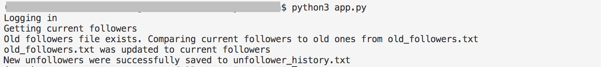
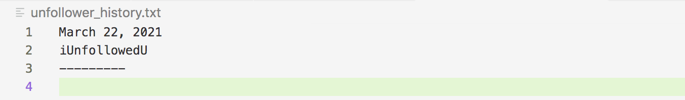
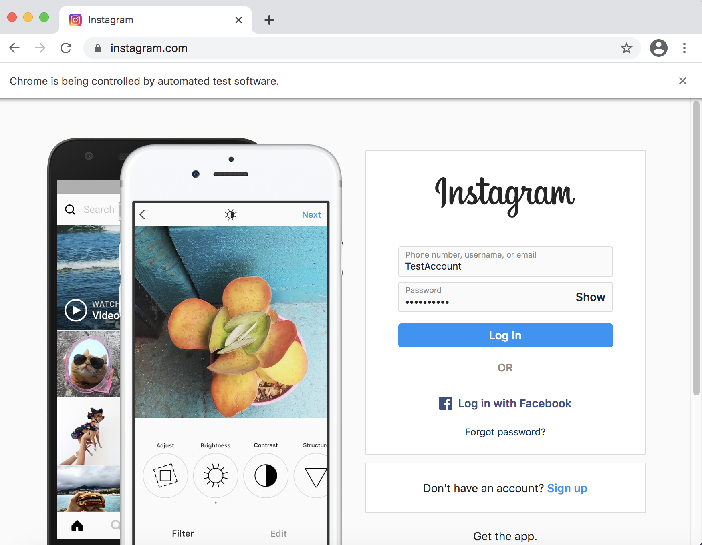

# Instagram-Unfollow-Bot
This automated app logs a user into Instagram and finds who has unfollowed them.
As of now, it seems like the most popular option to find unfollowers is to use a
third-party app. That requires providing your login credentials to them
though, which some would like to avoid. This app is a way to find
unfollowers using web automation and avoids revealing sensitive information
to third-parties.

I learned the automated login part of this app from the following tutorial
- Aaron Jack (YT): https://www.youtube.com/watch?v=d2GBO_QjRlo

## To run
First, download the dependencies through the shell:
```sh
pip3 install -r requirements.txt
```
Third, create a file `instagram_login.py` inside this folder and insert
the following:
```
username = 'yourUsername'
password = 'yourPassword'
has_2FA = 'True/False'
```
You should insert your actual username and password into lines 1 and 2, and you should
insert 'True' or 'False' for line 3 depending on whether you have Two-factor authentication
turned on or off for your account.

Lastly, run the app through the shell:
```sh
python3 app.py
```
The first time you run the app, it will create a new file `old_followers.txt`
with your current followers. Further runs will update `old_followers.txt` with
your current followers and append any found unfollowers to `unfollower_history.txt`
along with the date the app was run.

## Example




## Selenium & ChromeDriver Information
[Documentation](https://chromedriver.chromium.org/getting-started)

The Selenium package is used for automating web browser interaction.
The ChromeDriver tool is used for navigating to web pages, user input,
JavaScript execution, and more.
Selenium uses ChromeDriver to control Google Chrome.
